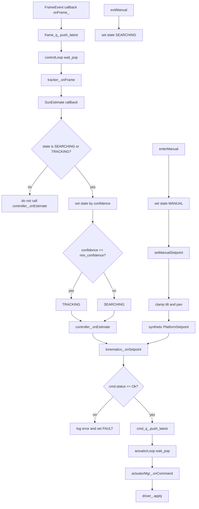

You’re right.
For this document, **one Mermaid diagram is not enough**.

A good state-machine doc here should have **3 diagrams**:

1. **overall runtime state graph**
2. **startup/shutdown path**
3. **AUTO / MANUAL / FAULT behaviour**

And they must match the code exactly, especially:

* `STARTUP -> NEUTRAL -> SEARCHING`
* `TRACKING <-> SEARCHING`
* `enterManual()` only works from running non-fault states
* `exitManual()` goes to `SEARCHING`
* `FAULT` does **not** go directly to `IDLE` by reset
* `FAULT -> STOPPING` only when `stop()` is called
* `STOPPING -> IDLE`
* startup “neutral” is actually **startup park command**
* stop path applies **neutral setpoint** before final driver stop

Below is a **copy-ready corrected version** with **3 Mermaid diagrams** that matches the code.

````md
# System State Machine

This document defines the runtime behaviour of the Solar Stewart Tracker as a state machine.

It describes the current implemented state flow of the system.

---

## 1. States

| State | Meaning | Outputs |
|------|---------|---------|
| IDLE | System not running | No motion |
| STARTUP | Initialisation in progress | Startup sequence in progress |
| NEUTRAL | Transitional safe positioning state | Configured startup park applied |
| SEARCHING | Sun not confidently detected | Frame-driven processing continues with safe low-motion behaviour |
| TRACKING | Sun detected with sufficient confidence | Normal closed-loop updates |
| MANUAL | User controls setpoint | Manual setpoint → kinematics → actuator path, bounded by limits |
| STOPPING | Shutdown in progress | Stop sequence in progress |
| FAULT | Failure state | Outputs stopped / system held in faulted state |

---

## 2. Transition Rules

| From | To | Trigger |
|------|----|---------|
| IDLE | STARTUP | `SystemManager::start()` called |
| STARTUP | FAULT | camera is null, driver start fails, or camera start fails |
| STARTUP | NEUTRAL | startup sequence completes successfully |
| NEUTRAL | SEARCHING | startup park applied and system enters normal searching mode |
| SEARCHING | TRACKING | `SunEstimate.confidence >= min_confidence` |
| TRACKING | SEARCHING | `SunEstimate.confidence < min_confidence` |
| SEARCHING | MANUAL | `enterManual()` |
| TRACKING | MANUAL | `enterManual()` |
| NEUTRAL | MANUAL | `enterManual()` if invoked while running in that transitional state |
| MANUAL | SEARCHING | `exitManual()` |
| SEARCHING | STOPPING | `stop()` called |
| TRACKING | STOPPING | `stop()` called |
| MANUAL | STOPPING | `stop()` called |
| NEUTRAL | STOPPING | `stop()` called |
| STARTUP | STOPPING | `stop()` called during running startup path |
| FAULT | STOPPING | `stop()` called |
| STOPPING | IDLE | stop sequence completes |
| SEARCHING | FAULT | critical runtime failure surfaced |
| TRACKING | FAULT | critical runtime failure surfaced |
| MANUAL | FAULT | critical runtime failure surfaced |
| NEUTRAL | FAULT | critical runtime failure surfaced |

The implemented reacquisition behaviour is the simplified transition:

`TRACKING ↔ SEARCHING`

based on the confidence threshold.

There is no separate `REACQUIRE` state in the current implementation.

---

## 3. State descriptions

### IDLE

The system is not running.

Characteristics:
- camera is not streaming
- worker threads are not active
- no new motion commands are produced

### STARTUP

The system is performing startup actions.

Characteristics:
- `running_` becomes true
- camera validity is checked
- servo driver start is attempted
- queues are reset
- control and actuator threads are started
- camera start is attempted
- startup failure causes transition to `FAULT`

### NEUTRAL

`NEUTRAL` is a short transitional state used during startup.

Characteristics:
- the system applies the configured startup park angles using `applyParkOnce_(startup_park_deg_)`
- this is a direct actuator park command
- it is not a kinematic solve for tilt = 0 and pan = 0
- after this step, the system proceeds to `SEARCHING`

### SEARCHING

The system is running but the sun is not currently detected with sufficient confidence.

Characteristics:
- frames continue to be processed
- `SunTracker`, `Controller`, `Kinematics3RRS`, `ActuatorManager`, and `ServoDriver` remain active
- automatic processing is allowed in this state
- if confidence rises sufficiently, the system transitions to `TRACKING`

### TRACKING

The system is confidently tracking the target.

Characteristics:
- each incoming frame drives the normal event-driven update path
- controller, kinematics, actuator shaping, and servo output are active
- if confidence drops below threshold, the system transitions back to `SEARCHING`

### MANUAL

The user directly commands motion through the manual path.

Characteristics:
- `enterManual()` sets the state to `MANUAL`
- automatic frame-driven control updates do not propagate through `controller_.onEstimate()` because auto processing is only allowed in `SEARCHING` and `TRACKING`
- `setManualSetpoint()` creates a bounded synthetic `PlatformSetpoint`
- manual setpoints still pass through kinematics, actuator shaping, and servo output
- `exitManual()` returns the system to `SEARCHING`

### STOPPING

The system is shutting down.

Characteristics:
- `running_` becomes false
- camera is stopped
- frame queue is stopped and control thread is joined
- command queue is cleared and reset
- `applyNeutralOnce_()` sends a zero tilt/pan setpoint through kinematics before final shutdown
- command queue is then stopped and actuator thread is joined
- driver is stopped
- latency summary is printed
- final state becomes `IDLE`

### FAULT

The system has entered a faulted state because a critical condition was detected.

Characteristics:
- startup failures can enter `FAULT`
- degraded or invalid kinematics output causes:
  - log error
  - `setState_(TrackerState::FAULT)`
  - no command queued for actuation
- there is no explicit internal reset/restart transition
- shutdown from `FAULT` occurs only through `stop()`

---

## 4. Mermaid Diagram 1 — Overall Runtime State Graph

```mermaid
stateDiagram-v2
    [*] --> IDLE

    IDLE --> STARTUP: start()

    STARTUP --> NEUTRAL: driver + camera started
    STARTUP --> FAULT: null camera / driver start fail / camera start fail

    NEUTRAL --> SEARCHING: startup park applied

    SEARCHING --> TRACKING: confidence >= threshold
    TRACKING --> SEARCHING: confidence < threshold

    SEARCHING --> MANUAL: enterManual()
    TRACKING --> MANUAL: enterManual()
    NEUTRAL --> MANUAL: enterManual()

    MANUAL --> SEARCHING: exitManual()

    SEARCHING --> FAULT: critical runtime failure
    TRACKING --> FAULT: critical runtime failure
    MANUAL --> FAULT: critical runtime failure
    NEUTRAL --> FAULT: critical runtime failure

    STARTUP --> STOPPING: stop()
    NEUTRAL --> STOPPING: stop()
    SEARCHING --> STOPPING: stop()
    TRACKING --> STOPPING: stop()
    MANUAL --> STOPPING: stop()
    FAULT --> STOPPING: stop()

    STOPPING --> IDLE: shutdown complete
````

---

## 5. Mermaid Diagram 2 — Startup and Shutdown Path

```mermaid
flowchart TD
    A[start()] --> B[set state STARTUP]
    B --> C{camera_ valid?}
    C -- no --> F1[set FAULT and return false]
    C -- yes --> D{driver_.start()?}
    D -- no --> F2[set FAULT and return false]
    D -- yes --> E[reset frame and command queues]
    E --> G[start control_thread_ and actuator_thread_]
    G --> H{camera_->start()?}
    H -- no --> F3[stop queues and join threads]
    F3 --> F4[driver_.stop()]
    F4 --> F5[set FAULT and return false]

    H -- yes --> I[set state NEUTRAL]
    I --> J[applyParkOnce startup_park_deg_]
    J --> K[set state SEARCHING]
    K --> L[start returns true]

    M[stop()] --> N[set state STOPPING]
    N --> O[camera_->stop()]
    O --> P[frame_q_.stop and join control thread]
    P --> Q[cmd_q_.clear and reset]
    Q --> R[applyNeutralOnce]
    R --> S[cmd_q_.stop and join actuator thread]
    S --> T[driver_.stop]
    T --> U[latency_.printSummary]
    U --> V[set state IDLE]
```

---

## 6. Mermaid Diagram 3 — Automatic Processing vs Manual Processing



---

## 7. Important implementation notes

* `NEUTRAL` at startup is implemented as a **servo park command**, not as a kinematic neutral solve.
* `applyNeutralOnce_()` is used during `STOPPING`, not during startup.
* Automatic frame-driven control updates only run when the state is:

  * `SEARCHING`
  * `TRACKING`
* Manual setpoints bypass the automatic controller path but still go through:

  * `Kinematics3RRS`
  * `ActuatorManager`
  * `ServoDriver`
* Invalid or degraded kinematics commands do not continue to actuation; they trigger `FAULT`.
* There is no separate `REACQUIRE` state.
* There is no explicit `FAULT -> IDLE` reset transition inside the current implementation.

```
```
