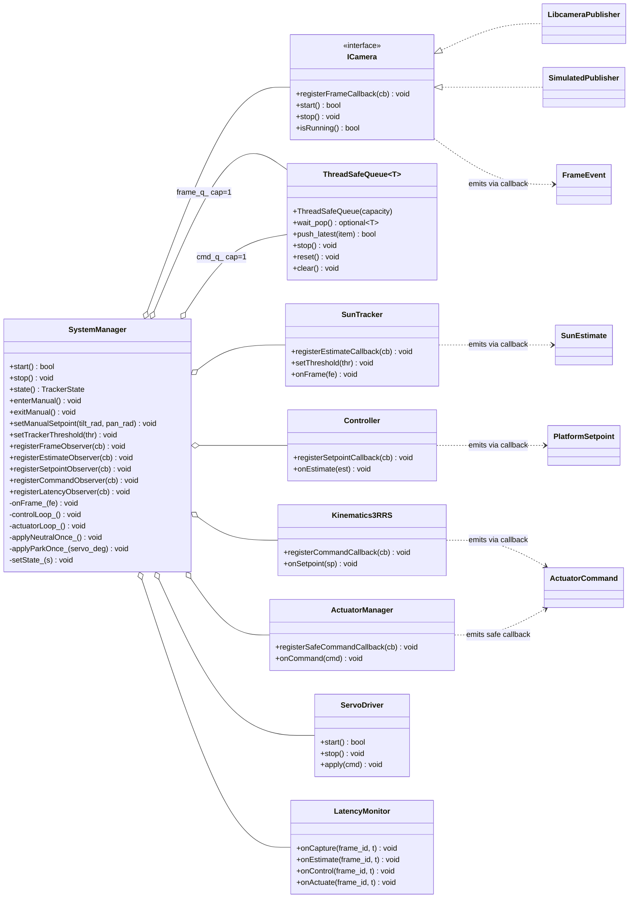
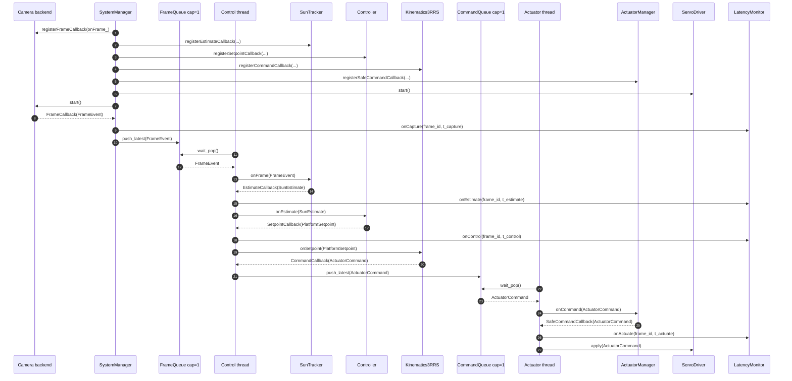
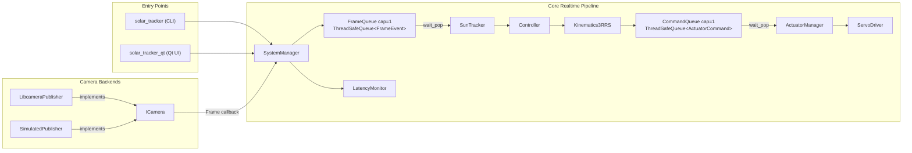

````md
# System Architecture

This document describes the current software architecture of the **Solar Stewart Tracker** repository.

The implementation is structured as an **event-driven, multi-threaded processing pipeline** with clear separation between:

- frame acquisition
- vision and control
- actuation and safety
- application/bootstrap logic
- optional user-interface layers

The same core pipeline is reused across:

- **Linux / Raspberry Pi** builds
- **desktop simulation** builds
- **CLI/headless** execution
- the optional **Qt GUI** target

------------------------------------------------------------------------

## 1) Related documents

This architecture should be read alongside:

- `docs/requirements.md`
- `docs/realtime_analysis.md`
- `docs/state_machine.md`
- `docs/testing.md`
- `docs/REPRODUCIBILITY.md`

------------------------------------------------------------------------

## 2) Architectural overview

The repository is organised around a staged runtime pipeline:

1. **Acquire**  
   A camera backend publishes `FrameEvent` objects.

2. **Estimate / Control / Kinematics**  
   The control thread consumes frames and produces actuator commands through:
   - `SunTracker`
   - `Controller`
   - `Kinematics3RRS`

3. **Safety / Actuation**  
   The actuator thread consumes commands and applies them through:
   - `ActuatorManager`
   - `ServoDriver`

Inter-stage communication is performed through **bounded blocking queues**:

- `ThreadSafeQueue<FrameEvent>` with capacity **1**
- `ThreadSafeQueue<ActuatorCommand>` with capacity **1**

This gives the system a **freshest-data policy**:
when a queue is full, the newest item is retained and the oldest item is dropped.

That design choice is appropriate for this repository because the tracker values:

- fresh sensor data
- bounded backlog
- low latency
- predictable pipeline behaviour

over processing every historical frame.

------------------------------------------------------------------------

## 3) High-level module structure

### 3.1 Core processing modules

The current repository core is built from the following main modules:

- `ICamera`  
  Abstract camera interface used by the system manager.

- `LibcameraPublisher`  
  Linux / Raspberry Pi camera backend, compiled only when `libcamera` is available.

- `SimulatedPublisher`  
  Simulation backend used when `libcamera` is unavailable.

- `SystemManager`  
  Top-level orchestrator that owns the processing modules, queues, worker threads, and state transitions.

- `SunTracker`  
  Vision stage that processes `FrameEvent` and produces `SunEstimate`.

- `Controller`  
  Converts `SunEstimate` into `PlatformSetpoint`.

- `Kinematics3RRS`  
  Converts `PlatformSetpoint` into `ActuatorCommand`.

- `ActuatorManager`  
  Applies command limiting and safety shaping before final output.

- `ServoDriver`  
  Sends actuator commands to hardware or log-only output.

- `LatencyMonitor`  
  Collects timing measurements across the pipeline.

### 3.2 Application/bootstrap modules

The repository also includes application-level bootstrap code:

- `app::AppConfig`  
  Holds runtime configuration values.

- `app::SystemFactory`  
  Creates the camera backend and `SystemManager` from configuration.

- `app::Application`  
  Starts the system and wires optional UI observers.

- `app::LinuxEventLoop`  
  Linux event loop for signal handling, CLI input, and periodic UI ticking.

- `app::CliController`  
  Headless and terminal command interface.

### 3.3 Optional UI modules

Optional UI components exist separately from the core pipeline:

- `ui::UiViewer`  
  OpenCV-backed viewer support compiled into the CLI path when OpenCV is found.

- `src/qt/main_qt.cpp` and `MainWindow`  
  Optional Qt GUI target built as `solar_tracker_qt` when Qt5 is found.

The UI layers observe the pipeline; they do not replace the processing architecture.

------------------------------------------------------------------------

## 4) Entry points and build variants

The current repository provides the following application entry points.

### 4.1 CLI / headless application

Target:

- `solar_tracker`

Entry source:

- `src/main.cpp`

Bootstrap flow:

- `app::Application`
- `app::SystemFactory`
- `SystemManager`

On Linux, the CLI application uses `app::LinuxEventLoop`.

If OpenCV is available and enabled, `UiViewer` support is compiled into the CLI path.

### 4.2 Qt GUI application

Target:

- `solar_tracker_qt`

Entry source:

- `src/qt/main_qt.cpp`

This target is built only when Qt5 is found.

It reuses the same underlying processing architecture rather than introducing a separate control pipeline.

### 4.3 Camera backend selection

Camera backend selection is handled by `app::SystemFactory`:

- if `libcamera` is available on supported Linux systems, the system uses `LibcameraPublisher`
- otherwise the system uses `SimulatedPublisher`

This keeps backend selection out of `main()` and centralises construction logic.

------------------------------------------------------------------------

## 5) Runtime threading model

The runtime design is event-driven and uses blocking waits rather than busy waiting.

### 5.1 Thread summary

| Thread / context | Main responsibility | Wake-up source |
|---|---|---|
| Camera backend thread or callback context | Acquire frames and emit callbacks | backend-specific event/callback mechanism |
| Control thread (`SystemManager`) | Vision + control + kinematics | blocking wait on `frame_q_` |
| Actuator thread (`SystemManager`) | Safety + output application | blocking wait on `cmd_q_` |
| Linux main/event thread | Signal handling, CLI input, UI ticking | blocking `poll()` on Linux |

### 5.2 Important accuracy note

The architecture avoids **busy polling loops** in the processing pipeline.

However, the current Linux application loop does use **blocking `poll()`** in `app::LinuxEventLoop`, which is an event-wait mechanism, not a spin loop.

So the accurate statement is:

- the runtime path is **event-driven**
- worker threads **block while waiting for work**
- the implementation does **not** rely on active busy-wait polling in the pipeline stages

------------------------------------------------------------------------

## 6) Data flow through the pipeline

The main runtime data path is:

`ICamera` -> `SystemManager::onFrame_()` -> `frame_q_` -> `SunTracker` -> `Controller` -> `Kinematics3RRS` -> `cmd_q_` -> `ActuatorManager` -> `ServoDriver`

### 6.1 Data payloads

The current payload types are defined in `include/common/Types.hpp`:

- `FrameEvent`
- `SunEstimate`
- `PlatformSetpoint`
- `ActuatorCommand`

### 6.2 Stage-by-stage flow

#### Stage A: Frame acquisition

A camera backend delivers a `FrameEvent` through the registered frame callback.

This callback reaches:

- `SystemManager::onFrame_()`

`SystemManager` records capture timing and pushes the frame into:

- `frame_q_`

#### Stage B: Vision and control

The control worker thread blocks on:

- `frame_q_.wait_pop()`

When a frame is available, the thread runs:

1. `SunTracker`
2. `Controller`
3. `Kinematics3RRS`

When the system is in automatic operation, this produces an `ActuatorCommand`, which is pushed into:

- `cmd_q_`

#### Stage C: Safety and actuation

The actuator worker thread blocks on:

- `cmd_q_.wait_pop()`

When a command is available, it runs:

1. `ActuatorManager`
2. `ServoDriver`

This stage is responsible for final output application.

------------------------------------------------------------------------

## 7) Queue design and realtime behaviour

The current queue configuration is intentionally small:

- frame queue capacity = **1**
- command queue capacity = **1**

### 7.1 Why capacity 1 is used

This ensures:

- old frames do not accumulate
- stale commands are discarded
- the actuator path uses the newest available command
- latency remains bounded by design

### 7.2 Freshest-data policy

The queue utility supports `push_latest()` behaviour.

If a queue is already full:

- the oldest item is removed
- the newest item is inserted

This means the architecture prioritises **freshness over completeness**.

That is a defensible design for a tracker/control pipeline where the newest input is typically more valuable than preserving all historical data.

------------------------------------------------------------------------

## 8) State and control ownership

`SystemManager` is the main coordination point for:

- lifecycle (`start()`, `stop()`)
- worker thread ownership
- state transitions
- manual mode entry and exit
- observer registration
- queue ownership
- latency aggregation hooks

The state type is defined in:

- `include/system/TrackerState.hpp`

The detailed state-machine description is documented separately in:

- `docs/state_machine.md`

This document focuses on the **software structure** rather than the full behavioural transition table.

------------------------------------------------------------------------

## 9) Observer and telemetry hooks

The current architecture exposes observer hooks for UI and telemetry integration.

`SystemManager` supports registration for:

- frame observers
- estimate observers
- setpoint observers
- command observers
- latency observers

This lets the UI layer observe runtime behaviour without owning the real-time pipeline itself.

That separation is useful for:

- headless operation
- Qt UI integration
- OpenCV viewer integration
- latency and telemetry display

------------------------------------------------------------------------

## 10) Latency instrumentation

The repository includes latency instrumentation through:

- `common::LatencyMonitor`
- `SystemManager` timing bookkeeping

The implemented measurement points include:

- capture time
- estimate generation time
- control output time
- actuation application time

This enables reporting of stage-to-stage latency such as:

- capture -> estimate
- estimate -> control
- control -> actuation

Detailed discussion of timing analysis belongs in:

- `docs/realtime_analysis.md`
- `docs/latency_measurement.md`

------------------------------------------------------------------------

## 11) Separation of concerns

The architecture is designed to keep responsibilities separated.

### 11.1 Sensor abstraction

Camera acquisition is isolated behind:

- `ICamera`

This allows the repository to support both:

- Raspberry Pi camera input
- desktop simulation

without changing the control pipeline API.

### 11.2 Vision/control separation

The vision stage, controller, and kinematics stage are separate modules:

- `SunTracker`
- `Controller`
- `Kinematics3RRS`

This improves testability and prevents camera-specific code from leaking into control logic.

### 11.3 Safety/output separation

The actuation path is also split:

- `ActuatorManager`
- `ServoDriver`

This keeps output policy separate from the low-level hardware command application layer.

### 11.4 Bootstrap separation

Construction and application startup are separated from the control logic:

- `AppConfig`
- `SystemFactory`
- `Application`

That keeps entry points thin and reduces duplicated setup logic.

------------------------------------------------------------------------

## 12) Current repository file mapping

### 12.1 Core headers

- `include/common/ThreadSafeQueue.hpp`
- `include/common/Types.hpp`
- `include/common/LatencyMonitor.hpp`
- `include/common/Logger.hpp`
- `include/sensors/ICamera.hpp`
- `include/sensors/LibcameraPublisher.hpp`
- `include/sensors/SimulatedPublisher.hpp`
- `include/vision/SunTracker.hpp`
- `include/control/Controller.hpp`
- `include/control/Kinematics3RRS.hpp`
- `include/actuators/ActuatorManager.hpp`
- `include/actuators/ServoDriver.hpp`
- `include/actuators/PCA9685.hpp`
- `include/system/SystemManager.hpp`
- `include/system/TrackerState.hpp`

### 12.2 Core sources

- `src/sensors/LibcameraPublisher.cpp`
- `src/sensors/SimulatedPublisher.cpp`
- `src/vision/SunTracker.cpp`
- `src/control/Controller.cpp`
- `src/control/Kinematics3RRS.cpp`
- `src/actuators/ActuatorManager.cpp`
- `src/actuators/ServoDriver.cpp`
- `src/actuators/PCA9685.cpp`
- `src/system/SystemManager.cpp`

### 12.3 Application/bootstrap sources

- `src/main.cpp`
- `src/app/AppConfig.cpp`
- `src/app/Application.cpp`
- `src/app/CliController.cpp`
- `src/app/LinuxEventLoop.cpp`
- `src/app/SystemFactory.cpp`

### 12.4 Optional UI sources

- `src/ui/UiViewer.cpp`
- `src/ui/OverlayDraw.cpp`
- `src/qt/main_qt.cpp`
- `src/qt/MainWindow.cpp`
- `src/qt/MainWindow.hpp`

------------------------------------------------------------------------

## 13) Requirement-to-architecture mapping

| Architectural responsibility | Main module(s) |
|---|---|
| Frame acquisition | `ICamera`, `LibcameraPublisher`, `SimulatedPublisher` |
| Frame transport | `ThreadSafeQueue<FrameEvent>` |
| Sun detection and estimation | `SunTracker` |
| Control law | `Controller` |
| Platform-to-actuator mapping | `Kinematics3RRS` |
| Command transport | `ThreadSafeQueue<ActuatorCommand>` |
| Safety limiting and command shaping | `ActuatorManager` |
| Hardware output | `ServoDriver`, `PCA9685` |
| Lifecycle and state control | `SystemManager` |
| App bootstrap | `AppConfig`, `SystemFactory`, `Application` |
| Linux signal/input event loop | `LinuxEventLoop`, `CliController` |
| Telemetry and latency observation | `LatencyMonitor`, observer callbacks |
| Optional GUI and viewer layer | `UiViewer`, Qt UI sources |

------------------------------------------------------------------------

## 14) Architecture diagram

The repository includes the following architecture image:

```text
diagrams/Threaded Event-Driven System Architecture Diagram.png
````

Embedded reference:


---

## 15) UML / Architecture Diagrams

These diagrams describe the high-level, event-driven architecture of the current repository.

### 15.1 UML Class Diagram



---

### 15.2 Sequence Diagram — Runtime Pipeline



---

### 15.3 Component Diagram



---

## 16) Summary

The current repository architecture is characterised by:

* a shared core pipeline reused by multiple application entry points
* bounded blocking queues between major stages
* backend abstraction for camera input
* separated vision, control, kinematics, safety, and output modules
* observer hooks for UI and telemetry
* optional GUI and viewer layers kept outside the core processing architecture

The architecture is therefore best described as:

**event-driven, queue-based, modular, and multi-threaded**, with optional platform-specific backends and UI layers built around the same core system.

```
```
